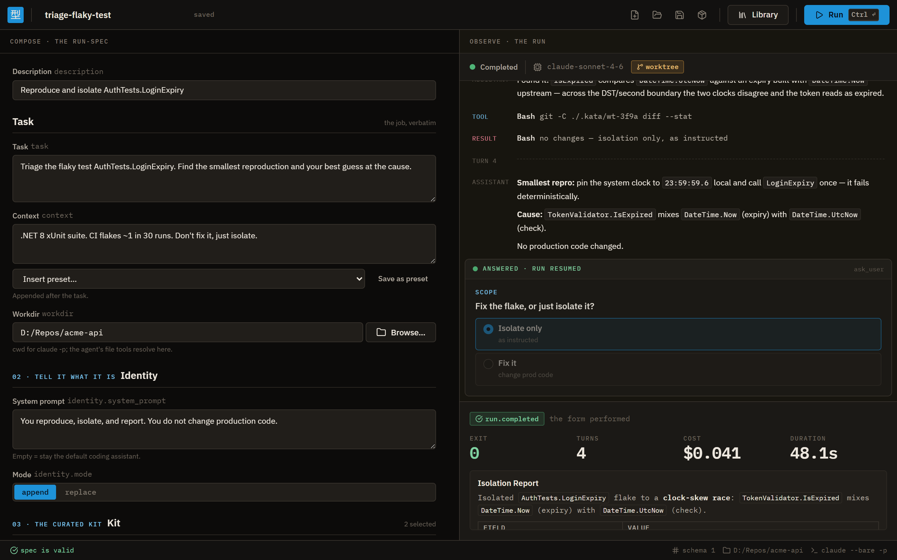
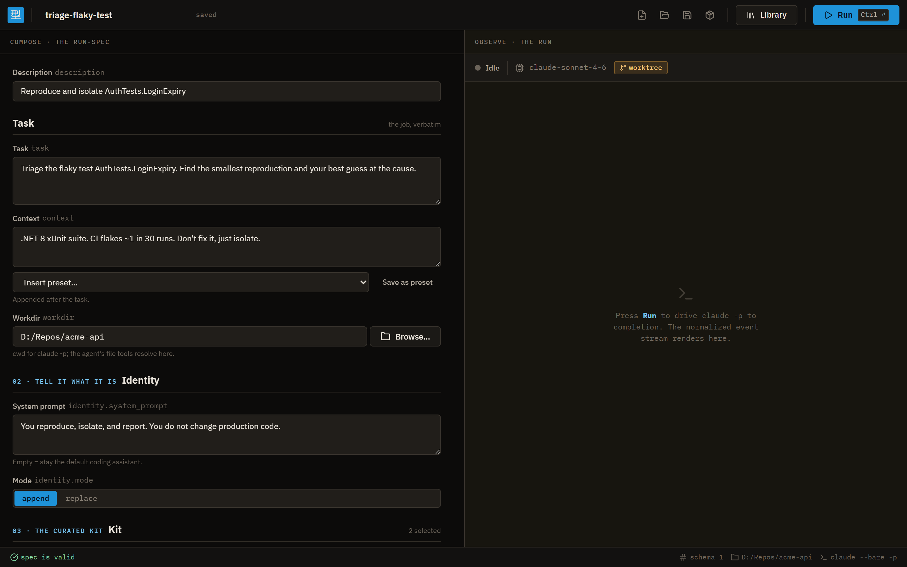
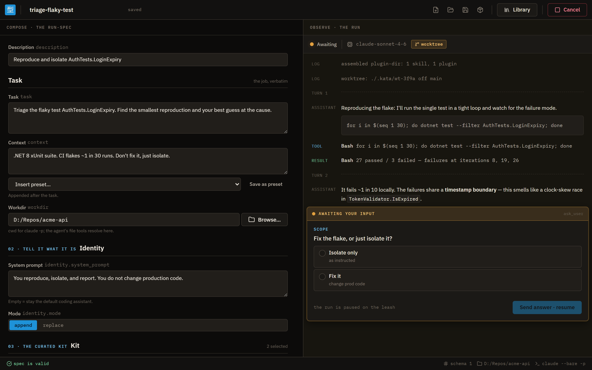
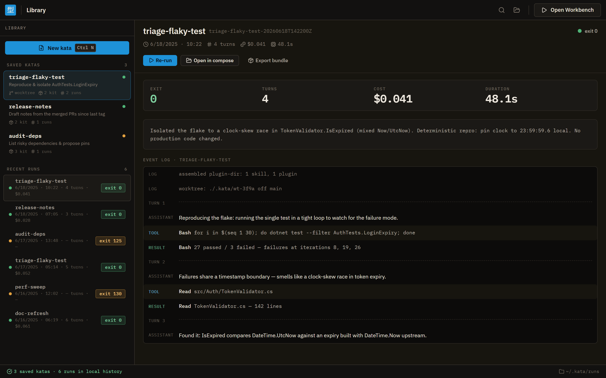

# Kata

[](https://github.com/satish-krishna/kata/actions/workflows/ci.yml)
[](https://github.com/satish-krishna/kata/releases)
[](LICENSE)

**A launcher for single, headless coding-agent runs.** You compose a *run-spec* — one precise, reproducible form for a job — and Kata runs it by driving `claude -p` to completion and observing it. The name is deliberate: a kata is a craftsman's drilled form, and a run-spec is exactly that — one exact form that runs identically on your machine, a teammate's, and a CI box.



## What Kata is

Kata never owns the agent loop; it *rents* it (via `claude -p`) and controls the edges. A run-spec serializes four decisions plus a leash:

- **The empty room** — `claude --bare` loads nothing by default.
- **Tell it what it is** — an appended (or replacing) system prompt retasks the assistant.
- **A folder of exactly the right skills** — a disposable `--plugin-dir` assembled per run (the "kit").
- **The leash** — cap turns and wall-clock time, optionally contain writes in a git worktree, observe, check the exit code.

The `kata` binary is the single execution path the GUI, the Shokunin orchestrator, and CI all share.

## A look at the Workbench

The Workbench is a desktop app — Layout A: compose the run-spec on the left, observe the run on the right.

| Compose the run-spec | Observe a completed run |
| --- | --- |
|  |  |
| **Answer a mid-run question** | **Saved katas & run history** |
|  |  |

## Quickstart

### Install

Grab a build from [Releases](https://github.com/satish-krishna/kata/releases) (Windows x64 today):

- **Workbench** — `Kata.Workbench_<version>_x64-setup.exe` (installer) or the `.msi`.
- **CLI** — `kata_<version>_x64.exe`, the standalone engine.

Or build from source (any platform with a Rust toolchain):

```console
$ cargo build --locked --release
$ ./target/release/kata --help
```

A real run needs an authenticated `claude` on your `PATH`.

### Your first kata

Write a run-spec:

```toml
# triage.kata.toml
name    = "triage-flaky"
task    = "Find and fix the flaky test in this repo."
workdir = "/repo"
skills  = ["triage-flaky-test"]

[leash]
max_turns    = 12
timeout_secs = 600
```

Run it. Kata drives `claude -p` to completion and streams a normalized, one-object-per-line event protocol on stdout:

```console
$ kata run triage.kata.toml
{"type":"run.started","spec":"triage-flaky","workdir":"/repo","isolation":"none"}
{"type":"assistant.text", ...}
{"type":"tool.use", ...}
{"type":"run.completed","exit_code":0, ...}
```

The CLI has three more verbs: `kata validate <spec>` (pure validation), `kata catalog` (discover installed skills/plugins as JSON), and `kata bundle <spec>` (vendor a portable bundle — see below).

## How it works — the edges

Kata's whole job is controlling the four edges around a rented agent loop, then enforcing the leash.

- **The empty room.** Runs start from `claude --bare` (default-on, switchable per run), so nothing leaks in from your ambient `~/.claude` unless the spec asks for it.
- **Retasking.** A system prompt is appended to — or replaces — the default coding assistant, telling the agent what it is for this one job.
- **The kit.** The skills and plugins a spec names are assembled into a disposable `--plugin-dir` for the run, then cleaned up.
- **The leash.** Turn cap, wall-clock timeout, optional git-worktree isolation for writes, and a budget ceiling. The outcome maps to a process exit code so CI and orchestrators can branch on it:

| Exit | Meaning |
| --- | --- |
| `0` | run completed |
| `122` | budget ceiling reached (`leash.max_budget_usd`) |
| `123` | answer deadline exceeded (interactive runs only) |
| `124` | wall-clock timeout (`leash.timeout_secs`) |
| `125` | turn cap reached (`leash.max_turns`) |
| `130` | cancelled |
| `1` | spec validation failure (CLI) |
| `2` | spec load/parse error (CLI) |

An unset turn cap means unlimited turns, bounded only by the wall-clock timeout. Exit 122 is a post-turn check, so actual spend can overshoot the ceiling by up to one turn.

## Bundling a kata for hand-off

Day-to-day, a run-spec references its skills and plugins by **name** — Kata resolves them from your installed `~/.claude` (and the project's `.claude`) at run time. That's convenient on your own machine, but a bare spec won't run on a box that doesn't already have those skills installed — a CI runner, a teammate's laptop, the orchestrator.

`kata bundle` solves that by *vendoring*: it copies the exact skills/plugins a spec resolves to into a self-contained folder, so the bundle carries everything the run needs.

```console
$ kata bundle triage.kata.toml -o triage-bundle
bundled to triage-bundle
```

The result is a portable folder — the spec, a vendored copy of each resolved skill/plugin under a `.claude/` tree, and a `kata-bundle.toml` marker that records what was vendored and where it came from:

```
triage-bundle/
  kata-bundle.toml          # marker + provenance manifest
  spec.toml                 # the run-spec, copied
  .claude/
    skills/
      triage-flaky-test/
        SKILL.md
```

Hand that folder to any machine and run it by pointing `kata run` at the directory instead of a spec file:

```console
$ kata run triage-bundle
{"type":"run.started","spec":"triage-flaky","workdir":"/repo","isolation":"none"}
{"type":"run.completed","exit_code":0, ...}
```

`kata run` sees the `kata-bundle.toml` marker and runs **hermetically**: it discovers the kit *only* from the bundle's own `.claude`, never the host's `~/.claude` or the target repo's `.claude`. The run depends solely on what the bundle carries, so it behaves identically wherever it lands — which is the whole point of a kata. (Re-bundle with `--force` to overwrite an existing output folder.)

## Interactive runs

By default, a Kata run is headless and observe-only. Add an `[interactive]` block to a spec to let claude pause mid-run and ask the operator a question; the Workbench (or any stdin-connected terminal) answers and the same `claude -p` session resumes with the answer fed back as a tool result.

```toml
[interactive]
enabled             = true   # default false — the opt-in gate
answer_timeout_secs = 600    # optional; omit to wait until answered or cancelled
```

When `enabled`, the engine wires a Kata-hosted `ask_user` MCP tool and appends a retasking note so claude knows to call it at consequential forks. claude calls the tool and blocks; the engine surfaces the question(s) and waits for an answer. When `enabled` is false (the default), `ask_user` is never offered — the headless contract is preserved exactly and every existing spec, CI run, and Shokunin job is unchanged.

**Question kinds** (four, via three `kind` values):

- `confirm` — Yes/No two-button choice.
- `select` with `multi_select: false` — single-choice radio.
- `select` with `multi_select: true` — multiple-choice checkboxes.
- `text` — free-form typed answer.

**The back-channel (extends kata-cli stdin).** Today `cancel` is the only line kata-cli's stdin understands. Interactive runs add one more shape beside it:

```
answer <id> <json>
```

`<id>` is the correlation id from the `ask.requested` event; `<json>` is the `answers: string[][]` payload — one inner array per question, carrying the chosen label(s) or typed text. `cancel` still works while awaiting (exits 130). An unattended interactive run that exceeds its `answer_timeout_secs` exits **123** (answer deadline exceeded) — distinct from 124 (work timeout) so CI logs can tell the two apart.

**Worked example:**

```console
$ kata run my-spec.toml
{"type":"run.started","spec":"my-spec", ...}
{"type":"ask.requested","id":"q1","questions":[{"kind":"select","header":"auth","question":"Which auth approach?","options":[{"label":"JWT"},{"label":"session cookie"}],"multi_select":false}]}
# operator answers on stdin:
answer q1 [["JWT"]]
{"type":"ask.answered","id":"q1","answers":[["JWT"]]}
{"type":"run.completed","exit_code":0, ...}
```

## The family

Kata sits in a small family of craft-named tools. The shared visual language should let them read as siblings:

- **Shokunin** (職人, "craftsman") — the orchestrator. Runs many forms.
- **Kata** (型, "form") — this product. Defines and performs one exact form.
- **Andon** (行灯 / アンドン) — the line monitor. The factory andon is a stack light (green / amber / red) that signals line status and the cord you pull to stop the line. Kata borrows the andon's stack-light palette for its run-status semantics — that visual rhyme ties the family together.

## Project status & contributing

Kata is under active development — see [ROADMAP.md](ROADMAP.md) for milestone status and [CONTRIBUTING.md](CONTRIBUTING.md) for the workflow. Design specs and plans live in `docs/superpowers/`; architecture notes for working in the codebase are in [CLAUDE.md](CLAUDE.md).

Licensed under [MIT](LICENSE).
