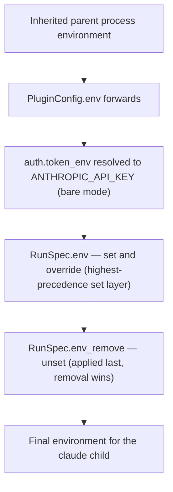

# Kata Enhancement — Per-Run Environment Override on RunSpec

**Target repository:** `satish-krishna/kata` (author it under kata's `docs/superpowers/specs/`; this copy lives in the Shokunin repo because that is where the driving requirement was brainstormed).
**Status:** Proposed. Awaiting review before an implementation plan is written.
**Date:** 2026-07-03.
**Affected crate:** `kata-core` (`crates/kata-core`). No change to `kata-cli` behavior beyond re-serialization; no change to the event protocol.

## Motivation

Shokunin drives kata **in-process** (`kata_core::run`) as the coding-agent harness for each Agent node in a flow. Shokunin owns model egress: Claude-target runs go direct to `api.anthropic.com`, non-Claude runs go through a bring-your-own Anthropic-compatible proxy, and the real API key is stripped on the proxy path. That egress decision is **per run** — two Agent nodes can execute concurrently against different models, hence different routing.

Today kata gives the caller no per-run control over the environment handed to the spawned `claude` child. The `claude` child inherits kata's (and therefore Shokunin's) process environment, and the only spec-level env levers are `auth.token_env` (forwarded to `ANTHROPIC_API_KEY`) and `PluginConfig.env` (names pulled from the parent process env). Neither can set `ANTHROPIC_BASE_URL` to an arbitrary value, and neither can strip an inherited variable.

Because kata-core runs in the host's process and does not clear the environment, the only way for an in-process host to vary the child's routing is to mutate its own process environment via `std::env::set_var` / `remove_var`. That is process-global, `unsafe` in edition 2024, and a data race the instant two runs overlap. It is therefore impossible today for an in-process host to give two concurrent `claude` children divergent egress. This enhancement closes that gap by making the environment a first-class, per-run, deterministic part of the `RunSpec` contract.

## Goals

- Let a caller set or override arbitrary environment variables for the `claude` child, per run, without mutating the host process environment.
- Let a caller unset (strip) variables that would otherwise be inherited by the `claude` child.
- Preserve today's behavior exactly when the new fields are absent or empty.
- Keep the change additive and backward-compatible on the run-spec contract (no `schema` version bump).
- Make concurrent runs with divergent environments correct by construction.

## Non-goals

- No move to a hermetic or allowlist-only environment. The `claude` child continues to inherit the parent environment by default; this change only adds targeted set and unset layers on top.
- No change to the `KataEvent` protocol or exit-code semantics.
- No new `kata` CLI flag for ad-hoc environment injection. The environment is expressed in the run-spec only. A CLI convenience flag may be considered as separate follow-up work.
- No change to how `auth.token_env` resolves and forwards `ANTHROPIC_API_KEY`; the new fields compose with it rather than replacing it.

## Current behavior (as of the reviewed source)

- `RunSpec` (in `spec.rs`) carries `schema`, `name`, `description`, `task`, `context`, `workdir`, `identity`, `skills`, `plugins`, `model`, `leash`, `auth`, `interactive`. There is no general environment field.
- `Auth` is `{ bare: bool, token_env: Option<String> }`.
- `PluginConfig` is `{ mcp: Option<bool>, env: Vec<String> }`, where `env` names variables resolved from the current process environment and forwarded to the child.
- `command.rs` assembles a `ClaudeInvocation` that includes `env: Vec<(String, String)>`, built from `auth.token_env` (bare mode) and each plugin's `env` forwards. It does not clear the environment; the actual `Command` is constructed in `run.rs`, so the `claude` child inherits the parent process environment.
- kata-core is synchronous (no `tokio`). `run` takes `(&RunSpec, &Catalog, &CancelToken, &AnswerRx, callback)` and returns `Result<RunOutcome, RunError>`.

## Proposed change

### New fields on `RunSpec`

```rust
/// Environment variables to set on the spawned `claude` child, overriding any
/// value inherited from the parent process, forwarded by a plugin, or derived
/// from `auth.token_env`. Applied per run to the child only; the host process
/// environment is never mutated.
#[serde(default)]
pub env: std::collections::BTreeMap<String, String>,

/// Environment variable names to unset on the spawned `claude` child, even if
/// present in the parent process environment or set by an earlier layer.
/// Applied last, so removal wins.
#[serde(default)]
pub env_remove: Vec<String>,
```

`BTreeMap` keeps serialization deterministic (ordered keys), which matters for reproducible run-specs and for stable golden-file tests. Both fields default to empty, so an existing spec that omits them deserializes and behaves exactly as before.

### Resolution order

The environment handed to the `claude` child is resolved in the following fixed order. Each later layer wins over earlier layers for the same key.



Concretely: `RunSpec.env` overrides an inherited variable, a plugin-forwarded variable, and the `token_env`-derived `ANTHROPIC_API_KEY`. `RunSpec.env_remove` then unsets any listed key regardless of which earlier layer set it, including the `token_env`-derived key.

### Determinism and concurrency requirement

The layers above **must** be applied to the child `Command` via `Command::env` / `Command::env_remove` (and, only if a fully controlled base is later desired, `Command::env_clear`). They **must not** be applied by mutating the host process environment (`std::env::set_var` / `remove_var`). This is the property that makes two concurrent in-process runs with different `env` values for the same key correct: each child gets its own value, with no cross-talk and no global state.

### Validation

`validate` (in the `spec` module) gains the following checks:

- A key that appears in both `env` and `env_remove` is rejected as ambiguous. The two fields must be disjoint.
- An empty or whitespace-only key in `env`, or an empty/whitespace-only name in `env_remove`, is rejected.
- A key in `env` that contains `=` is rejected (it cannot round-trip as an environment variable name).

These are hard validation errors so a malformed spec fails fast at load/validate time, consistent with kata's existing validation philosophy.

### Application point

The set and unset layers are applied where kata already assembles the child environment. `command.rs` builds `ClaudeInvocation.env` from `token_env` and plugin forwards; extend that assembly to append `RunSpec.env` entries (as overrides) and to carry the `RunSpec.env_remove` list through to `run.rs`, where the `Command` is finalized. `run.rs` applies the removals via `Command::env_remove` after all sets. The implementer should confirm the exact split between `command.rs` and `run.rs` against the current code; the behavioral contract above is what matters, not the internal division.

## Worked examples (the two egress paths this unblocks)

Direct-to-Anthropic run. The host forwards the real key and strips any inherited base URL so the child cannot be redirected off Anthropic:

```toml
[auth]
bare = true
token_env = "ANTHROPIC_API_KEY"

env_remove = ["ANTHROPIC_BASE_URL"]
```

Bring-your-own-proxy run. The host points the child at the proxy, supplies the proxy token, and strips the real key so it never leaves the host:

```toml
[auth]
bare = true
# token_env is omitted, so the real key is never forwarded.

[env]
ANTHROPIC_BASE_URL = "http://127.0.0.1:4000"
ANTHROPIC_AUTH_TOKEN = "proxy-token-value"

env_remove = ["ANTHROPIC_API_KEY"]
```

Both specs run correctly side by side in the same host process, each `claude` child seeing only its own routing.

## Backward compatibility and generated artifacts

- The run-spec `schema` version stays at `1`. Both fields are `#[serde(default)]`, so specs written before this change load unchanged, and specs written after this change that omit the fields behave identically to before.
- Regenerate the JSON Schema (the `schema` / `schemars` feature) so `schema/kata-events.schema.json`'s companion run-spec schema includes the new fields.
- Regenerate the TypeScript bindings (`cargo test -p kata-core --features ts export_bindings`) so downstream TypeScript consumers, including kata's own Workbench and Shokunin's frontend, see `env` and `env_remove`.
- Update `docs/consuming-kata.md` — add `env` and `env_remove` rows to the run-spec field table, and note the resolution order and the concurrency guarantee.
- Add a changelog entry if the repository keeps one.

## Testing

kata already ships a `fake-claude` test binary; use it as the child so tests can assert on the environment the child actually receives. If `fake-claude` does not already report its environment, extend it to emit the relevant variables (for example as a `log` event or a dump behind a test-only flag) so tests can observe the child's effective environment deterministically.

Required cases:

- A variable in `env` is present on the child with the given value.
- A variable in `env` overrides the same variable inherited from the parent process.
- A variable in `env_remove` is absent from the child even though it is present in the parent process.
- `env` overrides the `token_env`-derived `ANTHROPIC_API_KEY` when the same key is set.
- `env_remove` unsets the `token_env`-derived `ANTHROPIC_API_KEY`.
- Empty `env` and `env_remove` produce a child environment identical to the pre-change behavior (regression guard).
- `validate` returns an error when a key appears in both `env` and `env_remove`, when a key is empty/whitespace, and when a key in `env` contains `=`.
- Concurrency: two runs started with different `env` values for the same key each produce a child with the respective value, proving no shared-process-environment cross-talk. This is the case that justifies the whole enhancement.

## Acceptance criteria

- `RunSpec` exposes `env: BTreeMap<String, String>` and `env_remove: Vec<String>`, both defaulting to empty, both serialized deterministically.
- The child environment is resolved in the documented order, applied via the child `Command` and never via host-process mutation.
- `validate` enforces the disjointness, non-empty-key, and no-`=`-in-key rules.
- All test cases above pass, including the concurrency case.
- JSON Schema and TypeScript bindings are regenerated and include the new fields; pre-change specs still load.
- `docs/consuming-kata.md` documents the fields, the resolution order, and the concurrency guarantee.
- `cargo test --workspace` and `cargo clippy --all-targets -- -D warnings` are clean.

## Resolved decisions

- `env_remove` matches **exact variable names only**. No wildcard or prefix matching. If a concrete need for glob removal appears later, it is separate follow-up work.
- The two fields are **spec-only**. kata does not expose `env` / `env_remove` as `kata run` CLI flags in this change. A CLI convenience surface is deferred until an out-of-process consumer needs it.
