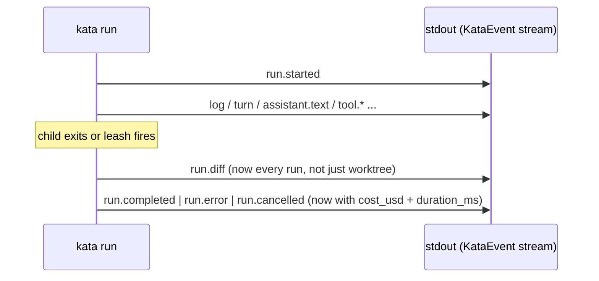

# Changeset capture on every run + cost/duration on all terminal events

## Problem

A Kata run ends with `run.completed` / `run.error` / `run.cancelled`, but a consumer cannot see what the agent did to the filesystem unless the run used `isolation = "worktree"`. The `run.diff` event (file list, insertions, deletions) fires only in worktree mode. Default `--bare` runs — the common case, executing directly in the workdir under `Isolation::None` — produce no changeset at all.

Separately, `run.error` and `run.cancelled` carry no cost or duration. `run.completed` already carries both (`cost_usd`, `duration_ms`); the other two terminal events carry only `exit_code` (and a `message` on `run.error`), so a consumer that hits a timeout, a cancel, a turn cap, or a budget ceiling learns nothing about how long the run took or what it spent.

The goal: every run — worktree or not — emits a `run.diff` describing the file changes, and every terminal event carries the run's cost and duration.

## Decisions taken during brainstorming

- **Reuse `run.diff` for all runs.** Do not duplicate changeset data onto the terminal events. `run.diff` remains the single "what changed" event; it simply stops being worktree-only.
- **Diff baseline is the end state.** For non-worktree runs the changeset is `git diff HEAD` (plus newly-created untracked files) at the moment the run ends — the same logic worktree mode uses today. This is deliberately simple and has a known limitation (below); clean per-run attribution remains the reason to choose `isolation = "worktree"`.
- **`run.diff`'s `worktree`/`branch` become optional.** Present only when the run is isolated; absent otherwise. One event for both modes.
- **Extract a `changeset` module.** The git-diff logic is no longer a worktree concern once non-worktree runs use it.

### Known limitation (documented, not a bug)

In default mode the changeset is the working tree versus `HEAD` at run's end. Any file left uncommitted *before* the run started is attributed to the run. A consumer wanting clean per-run attribution must use `isolation = "worktree"`, where the diff is taken against a fresh branch point. This limitation is stated in the `run.diff` field docs and in `docs/consuming-kata.md`.

## Contract impact

All changes are **additive** under `CONTRACTS.md` and land as a **minor** version bump (`1.0.0` → `1.1.0`). `KATA_EVENT_PROTOCOL_VERSION` stays `1` — the comment on that constant says bump only on a *breaking* change, and none of these are breaking:

- New optional fields on `run.error` and `run.cancelled` — a new optional field on an existing event is additive.
- `run.diff`'s `worktree`/`branch` loosened from required to optional — old worktree consumers still receive both fields on worktree runs; non-worktree runs never emitted `run.diff` before, so no existing stream shape changes. Loosening, not breaking.

The machine mirrors (`schema/kata-events.schema.json`, the ts-rs bindings, the schema-generated TS event types) regenerate; CI's drift gates enforce that they match.

## Design

### 1. The `changeset` module — `crates/kata-core/src/changeset.rs`

Holds the git-diff logic, lifted from `worktree.rs` and generalized to any directory.

- `pub struct DiffSummary { pub files: Vec<DiffFile>, pub insertions: u32, pub deletions: u32 }` — moved here from `worktree.rs`. `DiffFile` stays in `event.rs` (it is part of the event payload).
- `pub fn diff_at(dir: &Path) -> Result<DiffSummary, ChangesetError>` — the body of today's `worktree::diff`, taking an arbitrary directory instead of a `&Worktree`: `git -C <dir> diff HEAD --numstat`, `--name-status`, and `ls-files --others --exclude-standard` for untracked files. It never mutates the index. A non-git directory, a missing `git`, or any git failure surfaces as `Err` — the caller degrades to a warning.
- `pub enum ChangesetError` — `GitMissing`, `Git { cmd, status, stderr }`, `Io`. (The worktree-only `NotAGitRepo` / `NoHome` variants stay on `WorktreeError`, which keeps governing `worktree::create`.)

`worktree.rs` keeps `create` / `create_in` and its `Worktree` type; its `diff` function is removed, and its diff tests move to `changeset.rs` (they no longer need a worktree — a plain dirty repo suffices). `run.rs` is the only caller of the old `worktree::diff`, so nothing else needs updating.

### 2. Event shape changes — `crates/kata-core/src/event.rs`

```rust
RunDiff {
    #[serde(skip_serializing_if = "Option::is_none")]
    worktree: Option<String>,   // was String
    #[serde(skip_serializing_if = "Option::is_none")]
    branch: Option<String>,     // was String
    files: Vec<DiffFile>,
    insertions: u32,
    deletions: u32,
}

RunError {
    message: String,
    exit_code: i32,
    cost_usd: Option<f64>,      // new
    duration_ms: u64,           // new
}

RunCancelled {
    exit_code: i32,
    cost_usd: Option<f64>,      // new
    duration_ms: u64,           // new
}
```

`cost_usd` is `Option<f64>` without `skip_serializing_if`, matching `run.completed` (serializes as `null` when absent). `duration_ms` is always present.

**Why `cost_usd` is usually `null` on these two events.** claude reports `total_cost_usd` in its final `result` stream-json line. When the leash kills the child (timeout → 124, cancel → 130, turn cap → 125, answer deadline → 123), that line never arrives, so no cost is available — `cost_usd` is `None`. The one path that carries a real cost is budget exhaustion (exit 122): claude emits its `result` line, then the engine overrides the generic exit code, so the payload's cost is present. `duration_ms` (`start.elapsed()`) is always available. This is physics, not a gap to close — documented on the fields.

### 3. Run-loop wiring — `crates/kata-core/src/run.rs`

**Terminal events.** The termination `match` (currently around `run.rs:506`) threads `start.elapsed()` and the best-available cost into the new fields:

- Duration: `start.elapsed().as_millis() as u64`, captured at the match point (child already reaped), so it reflects the child's lifetime and excludes the post-run diff.
- Cost: `result.as_ref().and_then(|r| r.cost_usd)` for the leashed arms (usually `None`); the budget-exhaustion arm uses `payload.cost_usd` (present).

**Changeset.** The worktree-only diff block (currently `run.rs:580`) is replaced by an unconditional diff against `cwd` — which already resolves to the worktree path when isolated and the workdir otherwise:

```rust
match crate::changeset::diff_at(Path::new(&cwd)) {
    Ok(d) => emit(KataEvent::RunDiff {
        worktree: worktree.as_ref().map(|wt| wt.path.clone()),
        branch: worktree.as_ref().map(|wt| wt.branch.clone()),
        files: d.files,
        insertions: d.insertions,
        deletions: d.deletions,
    }),
    Err(e) => emit(KataEvent::Log {
        level: "warn".into(),
        message: format!("changeset diff failed: {e}"),
    }),
}
```

`run.diff` is emitted on any successful diff, including an empty one (`files: []` — "we checked, nothing changed"), matching today's worktree behavior. A non-git workdir or `git` failure yields `Err` → a `warn` log and no `run.diff`; the diff never masks the run outcome. As now, this sits after the termination match and before the terminal `emit`, so `run.diff` precedes the terminal event on every path — completed, error, cancelled, timed-out, max-turns.

### Event ordering (unchanged contract)



### 4. Regeneration and consumers

- Event schema: `KATA_BLESS_SCHEMA=1 cargo test -p kata-core --features schema schema_artifact_is_fresh`.
- ts-rs bindings: `cargo test -p kata-core --features ts export_bindings`.
- Schema-generated TS event types: `cd app && npm run gen:events`.
- `app/src/lib/events.ts` already excludes `run.diff` and the terminal events from stream rows; the new optional fields need no render change, but the `RunSummary` helpers may surface cost/duration for `run.error`/`run.cancelled` if desired (out of scope here — the events carry the data regardless).
- `docs/consuming-kata.md`: note that `run.diff` now fires on every run and state the end-state-baseline limitation.

## Testing (TDD)

- `changeset::diff_at` — modified tracked + new untracked in a plain dirty repo (moved from `worktree.rs`); a non-git directory returns `Err`; the index is never mutated.
- `event.rs` round-trip — `run.error` and `run.cancelled` serialize and deserialize with `cost_usd` + `duration_ms`; `run.diff` omits `worktree`/`branch` when `None` and includes them when `Some`.
- `run_it.rs` (drives `fake-claude`, `#[serial]`) — an `Isolation::None` run in a git workdir now emits `run.diff`; a run in a non-git workdir emits no `run.diff` and logs a warning; a terminal `run.completed` still carries cost/duration; a cancelled run's `run.cancelled` carries `duration_ms`.
- Schema freshness — the `schema_artifact_is_fresh` gate passes after regeneration.

## Out of scope

- Clean per-run attribution for non-worktree runs (before/after snapshot). Explicitly rejected in favor of the end-state baseline; `isolation = "worktree"` is the answer for clean attribution.
- Surfacing cost/duration for `run.error`/`run.cancelled` in the Workbench Observe pane UI. The data flows on the events; rendering it is a separate frontend task.
- Streaming incremental cost mid-run. claude only reports cost in its final `result` line; there is nothing to stream.

## Addendum: per-file-type breakdown on `run.diff`

Follow-on enhancement (same branch). `run.diff` gains a `by_type` field partitioning the changeset by file extension, so a consumer can see the changed-line volume per language without re-parsing paths.

New published type `DiffTypeStat { file_type: String, files: u32, insertions: u32, deletions: u32 }`, where `file_type` is the lowercased file extension (`rs`, `ts`, `md`) and `""` for files with no extension (e.g. `Makefile`, `LICENSE`, `.gitignore` — Rust's `Path::extension()` yields `None` for a leading-dot-only name).

`run.diff` gains `by_type: Vec<DiffTypeStat>`, sorted by `file_type` for deterministic output, carried `#[serde(default)]` so a pre-enhancement `run.diff` transcript line still deserializes (as `[]`). The field is a partition of the existing top-level totals: summing `by_type[*].insertions` equals `insertions` (same for deletions). The top-level totals and `DiffFile` are unchanged.

Computation lives in `changeset::diff_at`, which already knows each changed file's path and its `(insertions, deletions)` (tracked files from `git diff --numstat`, untracked files as `(line-count, 0)`); it folds each into a per-extension accumulator and emits the sorted vector. This is additive (minor) — `protocolVersion` stays 1, still shipped under 1.1.0.
