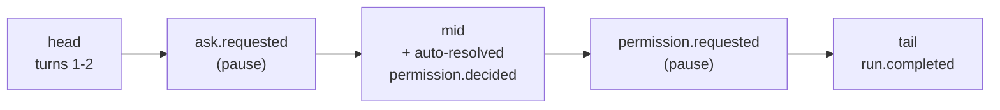

# Workbench permission prompts — design

**Date:** 2026-08-08
**Branch:** `claude/mcp-permission-prompts-managed-c0ysfs`
**Follows:** `2c50558` — *feat: explicit permission posture via an MCP permission-prompt tool*

## Problem

Commit `2c50558` added `[permissions]` to the run-spec, the engine-side rule
matcher, the `permission.requested` / `permission.decided` events, and the
Workbench surfaces for all three: `PermissionPanel.svelte`, the permissions
controls in `ComposePane.svelte`, and the store wiring in `run.svelte.ts`.

The engine half is exercised — 173 `kata-core` unit tests, 37 integration
tests, 19 CLI tests, all green. The Workbench half is not. The GUI approval
path has never executed, in a test or in a browser, and four defects follow
from that.

### 1. The approval card is unreachable in the browser

`mock.ts` scripts a run timeline for `?demo=run` and for the browser fallback.
It emits `ask.requested` but no permission event of either kind, so
`PermissionPanel` never renders outside the real Tauri app. `api.ts:90-98`
nonetheless fabricates a `permission.decided` carrying a hardcoded
`tool: "Bash"` and `input_summary: "rm -rf build/"` — a resume path for a pause
that cannot occur, echoing a request it never read.

### 2. No test covers the card or the controls

`PermissionPanel.svelte` has no test file. `ComposePane.test.ts` has no
permission coverage. Only `run.svelte.ts` is exercised, and only at the store
level — nothing asserts what the operator sees or what their click sends.

### 3. Stale rules become invisible

`ComposePane.svelte:287-317` renders the allow/deny textareas only under
`mode = "prompt"`, but flipping back to `bypass` leaves the entered rules in the
spec. `spec.rs:480-489` then rejects the run:

> permissions.allow/deny are only consulted under permissions.mode = "prompt"

The offending field is not on screen. The operator sees an error naming a
setting the pane is actively hiding from them.

### 4. Choosing `prompt` invalidates the spec immediately

`permissions.unmatched` defaults to `ask` and `interactive.enabled` defaults to
`false`. `spec.rs:491-497` forbids that pair, so the moment the operator selects
`prompt` the spec is invalid, with no inline indication of why or how to fix it.
`validateLocal` (`mock.ts:83-91`) mirrors none of the permission rules, so
browser review reports a clean spec the engine would refuse.

## Design

### A. Compose pane self-healing

The mode control moves from `bind:value` to an `onChange` handler. On a
`prompt → bypass` transition it clears `permissions.allow` and
`permissions.deny`. A spec can then never carry rules the engine rejects in a
field the pane is hiding.

When `mode = "prompt"`, `unmatched = "ask"`, and `interactive.enabled` is
`false`, an inline warning renders inside the Unmatched field: a `--warning`
dot paired with a label (per `app/CLAUDE.md` — a status colour always carries
both), and an **Enable interactive** button that sets
`spec.interactive.enabled = true`.

Both are spec mutations driven by operator input. The pane stays
presentational; no validation logic moves into it beyond the condition that
decides whether to show the hint.

### B. Browser validation mirrors the engine

`validateLocal` gains the three coherence rules from `spec.rs:480-505`:

1. allow/deny non-empty under `mode = "bypass"`
2. `unmatched = "ask"` with `interactive.enabled = false`
3. malformed rule syntax (`Tool`, `Tool(specifier)`, `*`; unbalanced
   parentheses and empty rules are errors)

Self-healing makes (1) unreachable through the UI, but a spec loaded from disk
can still carry it. The browser mirror must never be more optimistic than the
engine.

### C. A demo timeline that pauses on a permission

The scripted timeline becomes three segments rather than head/tail:

`resumeMockAfterAnswer` generalizes to `resumeMock(segment)`; `submitAnswer`
resumes the mid segment and `submitDecision` resumes the tail. The mid segment
carries a `permission.decided` with `decided_by: "rule"` so the auto-resolved
audit row renders alongside the interactive card.

`seedSpec` moves to `mode: "prompt"` with a small allow list and
`interactive.enabled: true`, making the seeded demo spec coherent under the
rules in (B) — it currently scripts an `ask.requested` against a spec with
interactive off.

`submitDecision`'s browser branch stops fabricating a tool call and echoes the
pending request it is answering.

### D. Tests

Written before the implementation, per the repo's TDD rule.

**`PermissionPanel.test.ts`** (new)

- pending: renders the tool name, the input summary, and both buttons
- pending: Allow sends `(id, true, null)`
- pending: Deny sends the trimmed reason; a blank reason sends `null`
- settled: buttons disabled, the taken verdict marked, the textarea gone
- settled: a denial message renders

**`ComposePane.test.ts`** (extended)

- allow/deny hidden under `bypass`
- flipping `prompt → bypass` clears entered rules
- `prompt` + `ask` + interactive off shows the warning; its button enables
  interactive and dismisses it
- blank lines are dropped when parsing rules

**`spec.test.ts`** (extended)

- `validateLocal` reports each of the three permission rules

### E. Verification

`npm test`, `npm run check`, `cargo fmt --all --check`,
`cargo clippy --all-targets -- -D warnings`, then `?demo=run` driven in a real
browser with a screenshot of the rendered approval card. Evidence before any
completion claim.

## Out of scope

`ObservePane.svelte:91-105` renders permission cards in a block after the event
stream rather than interleaved chronologically, matching how it already treats
asks. Fixing the ordering is a redesign touching both panels and is not part of
this feature.

A real end-to-end run under `npm run tauri:dev` against an authenticated
`claude` is not part of this slice; the automated suite plus the browser demo
cover the Workbench surfaces, and the engine path is covered by the integration
tests in `crates/kata-core/tests/run_it.rs`.
