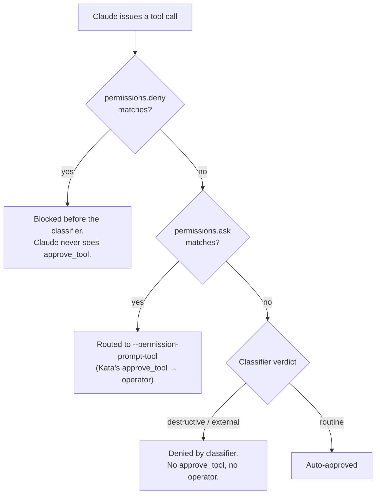

# Auto permission mode — design

**Date:** 2026-08-18
**Branch:** `feat/auto-permission-mode`
**Follows:** `986539a` — *feat: make prompt-mode permissions actually enforce (#38)*

## Problem

A run's permission posture today is one of two values: `bypass` (`--dangerously-skip-permissions`) or `prompt` (`--permission-prompt-tool`, with the spec's `allow`/`deny` written into a generated settings file and `unmatched` governing every call no rule matched). Both are all-or-nothing at the routine layer: `bypass` waves everything through, and `prompt` funnels every unruled call to the operator (or to a blanket `deny`/`allow` policy). There is no posture that lets an agent run with judgment — auto-approving routine work while stopping the irreversible or the exfiltrating — without either hand-authoring an exhaustive rule set or babysitting every call.

Claude Code's `--permission-mode auto` is exactly that posture: it routes each tool call through a classifier that blocks anything irreversible, destructive, or aimed outside the run's environment, and auto-approves the rest. It is not the coarse "auto-accept edits" of `acceptEdits`; it is a second AI gate that reads context and judges each action. Kata should expose it as a first-class permission mode so a run-spec can request classifier-gated autonomy without Kata cutting a release for every downstream tuning knob.

The catch, and the reason this is a designed feature rather than one more flag in `build_invocation`: auto mode is a subsystem, not a flag. Its checkpoints, its rule tiers, and its recovery path do not all map onto Kata's headless model. This spec pins exactly which parts Kata adopts now and which it defers, grounded in behavior verified against a real `claude` 2.1.235.

## What the probes established

Three real-claude runs under `--permission-mode <mode> --permission-prompt-tool <probe> --settings <rules>`, each firing a `Write` (an edit), a `curl` (risky shell), and an `rm` (covered by a `deny` rule), with a standalone MCP server logging every `approve_tool` call it received:

| `--permission-mode` | Write (edit) | `curl` (risky shell) | `rm` (in `deny`) | `approve_tool` consulted? |
| :--- | :--- | :--- | :--- | :--- |
| `auto` | auto-approved | auto-approved by classifier | blocked by `deny` | never |
| `auto` + `ask` rule on `curl` | auto-approved | routed to `approve_tool` | blocked by `deny` | for the `ask`-rule match only |
| `acceptEdits` | auto-approved | routed to `approve_tool` | blocked by `deny` | for every non-edit |
| `manual` (control) | routed to `approve_tool` | routed to `approve_tool` | blocked by `deny` | for everything |

The verified mechanism for `auto`, matching the [auto-mode configuration docs](https://code.claude.com/docs/en/auto-mode-config):

Three facts fall out of this, and the design rests on them:

1. `permissions.deny` runs before the classifier and blocks unconditionally — the `rm` was stopped in every row by the deny rule, never by mode.
2. `permissions.ask` is the only way to put Kata's operator in the loop under `auto`: the `approve_tool` bridge fires for an `ask`-rule match and for nothing else. `unmatched` has no path to reach it, because the classifier — not Kata — handles every unruled call.
3. The classifier's own denials never reach `approve_tool` and, headless, have no recovery path: no "Recently denied" tab, no `PermissionDenied` retry. A classifier block is a hard denial the run absorbs.

## Design

### A. The model: a third mode and a new rule list

`PermissionMode` gains `Auto` (serde `"auto"`), a peer of `Bypass` and `Prompt`.

`Permissions` gains `ask: Vec<String>`, a rule list in the same claude syntax as `allow`/`deny` (`Tool` or `Tool(specifier)`, `*` wildcard), carrying the same ts-rs and schemars attributes and the same `skip_serializing_if = "Vec::is_empty"`. It is a **general** field, honored under both `prompt` and `auto`, not an auto-only special case — a rule that forces the operator is useful in either mode, and binding a field to a single mode is the kind of hidden coupling this codebase avoids. Under `prompt`, an `ask` rule is a per-pattern operator checkpoint that sits beside the `unmatched` policy; under `auto`, `ask` rules are the operator's only entry point.

The resulting matrix, every cell probe-verified or a direct consequence of the mechanism above:

| field | `bypass` | `prompt` | `auto` |
| :--- | :--- | :--- | :--- |
| `allow` / `deny` | rejected by `validate` | written to settings; claude enforces | written to settings; claude enforces |
| `ask` | rejected by `validate` | written to settings; forces the operator | written to settings; forces the operator |
| `unmatched` | rejected by `validate` | governs unruled calls | rejected by `validate` — the classifier is the unmatched handler |

### B. Flag emission (`command.rs`)

The `match spec.permissions.mode` at `command.rs:71` gains an `Auto` arm that pushes both `--permission-mode auto` and `--permission-prompt-tool <PERMISSION_PROMPT_TOOL>`. The prompt tool is mandatory under `auto`, not optional: without it an `ask`-rule match has nowhere to route and the operator checkpoint silently evaporates. `Bypass` and `Prompt` arms are untouched. This is the first mode that emits two permission-related flags together; a comment records why, so a later "cleanup" does not strip the prompt tool as redundant.

### C. Bridge and settings generation (`run.rs`)

`run.rs:275` currently gates both the `approve_tool` advertisement and the generated settings file on `mode == Prompt`. That predicate widens to `mode == Prompt || mode == Auto`; introduce a local `permissions_need_bridge` (or reuse the existing flag renamed) so both call sites read the same intent. The settings object at `run.rs:343` gains `"ask": spec.permissions.ask` alongside the existing `allow`/`deny`.

### D. The auto tool-response path (`run.rs:558`)

Under `prompt`, a call that reaches `approve_tool` is one the settings did not resolve, so the `unmatched` policy (`Deny` / `Allow` / `Ask`) decides it. Under `auto` the semantics differ: a call only reaches the tool because an `ask` rule matched it, which is an explicit request to involve the operator. So the `auto` branch routes every reaching call to the operator unconditionally and never consults `unmatched`. Concretely, the decision site branches on mode: `Prompt` keeps the existing `unmatched` logic; `Auto` behaves as `prompt` + `unmatched = "ask"` would, minus the policy lookup. Because that path pauses on the operator, it carries the same interactive requirement enforced in (E).

### E. Validation (`spec::validate`)

The `match spec.permissions.mode` in `validate` extends as follows:

1. `Bypass` — unchanged: any non-empty `allow`, `deny`, or **now `ask`** is rejected, with the existing "only consulted under prompt/auto" message widened to name `ask` and `auto`.
2. `Prompt` — unchanged for `unmatched`; the `ask` list is now permitted and, if non-empty, triggers the interactive requirement in rule 4.
3. `Auto` — an explicit, non-default `unmatched` is **rejected**, not silently ignored, mirroring how `bypass` rejects rules it cannot honor. `allow`, `deny`, and `ask` are all permitted.
4. A non-empty `ask` list, or `unmatched = "ask"`, requires `[interactive] enabled = true` — the existing rule, now also reachable through `ask`. Nothing else can answer an operator pause.

Rule-syntax validation (`parse_rule`) already runs over every rule list; `ask` joins `allow`/`deny` in that loop at `spec.rs:507`, and its TypeScript mirror in `mock.ts` gains the same list.

### F. Tests

Written before the implementation, per the repo's TDD rule.

**`command.rs`** — `auto` emits both `--permission-mode auto` and `--permission-prompt-tool`; `bypass` and `prompt` still emit exactly what they did (guard against an accidental match-arm regression).

**`run.rs`** (integration, `run_it.rs`, `fake-claude`) — under `auto` the generated settings file contains the `ask` list; the `approve_tool` bridge is advertised under `auto` as it is under `prompt`; a `fake-claude` mode that emits an `ask`-matched call pauses on the operator under `auto`.

**`spec.rs`** — `auto` round-trips through TOML and JSON; `ask` round-trips; `validate` rejects `ask`/`allow`/`deny` under `bypass`; `validate` rejects a non-default `unmatched` under `auto`; `validate` requires interactive when `ask` is non-empty; a malformed `ask` rule is rejected.

**Real-claude smoke** (behind `KATA_SMOKE_REAL`) — a run under `auto` with an `ask` rule and a `deny` rule, asserting the deny blocks, the ask-matched call pauses, and a routine call is classifier-approved. This pins the composition the probes proved so a future claude release cannot regress it silently.

### G. Verification

`cargo test -p kata-core -p kata-cli`, `cargo fmt --all --check`, `cargo clippy --all-targets -- -D warnings`, `cargo build --locked`. Then the contract regeneration CI gates, each run and its artifact committed: `cargo test -p kata-core --features ts export_bindings`, `KATA_BLESS_SCHEMA=1 cargo test -p kata-core --features schema runspec_schema_artifact_is_fresh`. Evidence before any completion claim.

## Out of scope

The `autoMode` settings block — `environment`, `soft_deny`, `hard_deny`, `allow`, `classifyAllShell` — is deferred. Kata ships `auto` on the classifier's conservative defaults, which will false-block routine internal operations (pushes to non-default org remotes, writes to team buckets) because Kata supplies no trusted-infrastructure context. Surfacing `autoMode.environment` is a separate field family and a fast-follow, not this slice. This limitation is documented for the operator, not silently shipped.

Headless auto mode has no denial-recovery: the interactive "Recently denied" tab, the `r`-to-retry loop, and the `PermissionDenied` hook do not exist under `claude -p`. A classifier denial is terminal for that call — the model works around it or the run absorbs it. Kata does not attempt to reconstruct a retry channel.

The Workbench permission control (`ComposePane.svelte`) gains `auto` as a third mode option and an `ask` textarea, mirroring the existing allow/deny controls and their self-healing on mode transitions. The exact GUI treatment follows the pattern set in `2026-08-08-workbench-permission-prompts-design.md` and is specified in the implementation plan rather than redesigned here.

Exit-code semantics are unchanged. Auto mode introduces no new run outcome: a classifier denial surfaces as ordinary tool failure within the run, not as a distinct engine exit code.
